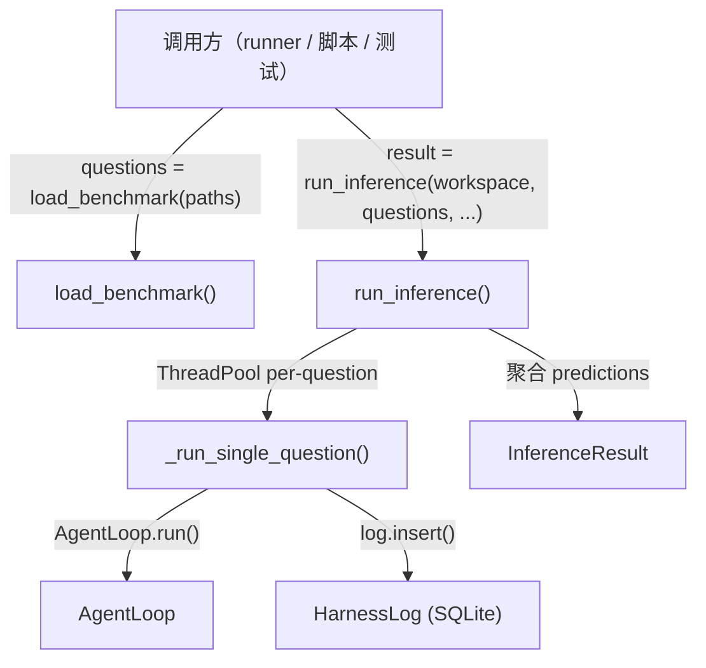

# 推理步骤（inference）编排设计

## 1. 设计动机

将 TRM4 已有的基础设施（AgentLoop、TreeEnvironment、Tools、PromptManager、SkillRegistry、HarnessLog、Workspace）组装为可独立运行的推理函数。参考 TRM3 的 `runner.py` 模式，但做出三个关键适配：

| 维度 | TRM3 | TRM4 |
|------|------|------|
| 并行粒度 | per-video（一个 worker 处理一个视频的全部 QA） | **per-question**（支持跨视频选题） |
| 数据来源 | 每个视频目录下的 question.json | **调用方传入 `list[GeneratedQuestion]`** |
| Hook 机制 | LoopHook 基类继承 | pluggy hookimpl |

## 2. 整体架构



## 3. 文件变更清单

| 文件 | 变更 | 内容 |
|------|------|------|
| `core/harness/question_gen.py` | 修改 | `options: dict` → `list[str]`；新增 `load_benchmark()` |
| `core/harness/inference.py` | 扩充 | 新增 `run_inference()` + `_run_single_question()` + `TracePlugin` |
| `core/harness/log.py` | 修改 | 添加 `threading.Lock` 保证并发写安全 |
| `core/search/skills.py` | 扩充 | 新增 `discover_skills()` |

## 4. 接口设计

### 4.1 题目格式统一

**变更**：`GeneratedQuestion.options` 从 `dict[str, str]` 改为 `list[str]`。

```python
@dataclass
class GeneratedQuestion:
    question_id: str
    video_id: str
    task_type: str
    question: str
    options: list[str]               # 改：["A. ...", "B. ..."]，对齐 benchmark
    answer: str
    source_nodes: list[str] = field(default_factory=list)
    difficulty: str = "medium"
```

原 `dict[str, str]` 格式是设计失误——benchmark 使用 `list[str]`，`format_user_prompt` 只需 `"\n".join(options)`，无需按字母索引。统一后 inference 只处理一种格式。

### 4.2 `load_benchmark()`

```python
def load_benchmark(questions_dir: Path) -> list[GeneratedQuestion]:
    """从 Store benchmark 目录加载题目。

    参数:
        questions_dir: benchmark 题目目录（如 store/questions/benchmarks/Video-MME）。
                       每个文件为 {video_id}.json，内含 list[dict]。

    返回:
        所有题目的 GeneratedQuestion 列表。
    """
```

### 4.3 `run_inference()`

```python
def run_inference(
    workspace_dir: Path,
    questions: list[GeneratedQuestion],
    concurrency: int,
    max_steps: int,
    skill_mode: str,
) -> InferenceResult:
    """在视频树上执行 Agent 推理，对应训练循环的 forward()。

    参数:
        workspace_dir: Workspace 根目录。
        questions: 待推理的题目列表（已筛选）。
        concurrency: 最大并行 worker 数。
        max_steps: AgentLoop 单题最大步数。
        skill_mode: "auto" / "manual" / "none"。

    返回:
        InferenceResult（含 accuracy、per_task_type 等聚合指标）。
    """
```

**内部流程**（四阶段）：

```
Phase 1 — Setup
├── resolve_paths(workspace_dir) → ResolvedPaths
├── run_id = 时间戳（YYYYMMDD_HHMMSS）
├── record_run(workspace_dir, run_id)
├── HarnessLog(db_path, run_id, config_snapshot={...})
├── PromptManager(prompts_dir)
├── discover_skills(skills_dir) → (always_text, task_skill_map, catalog_text, registry)
└── 创建 DB 表：predictions, traces, validation_flags

Phase 2 — Environment
├── 按 video_id 分组 questions
├── vl_client = LLMClient.from_env("VL_LLM", thinking=False)
├── tool_client = LLMClient.from_env("SEARCH_LLM", thinking=False)
└── 为每个 video_id 创建 TreeEnvironment(tree_json, tool_client, prompts_dir)

Phase 3 — Parallel Execution
├── ThreadPoolExecutor(max_workers=concurrency)
├── 每个 question 提交为一个 task → _run_single_question()
│   ├── worker 内部创建独立 search_client + AgentLoop
│   ├── 共享 TreeEnvironment（同 video_id）和 vl_client
│   └── 结果写入 HarnessLog
└── as_completed 收集结果，记录成功/失败

Phase 4 — Aggregate
├── 查询 predictions 表 → 计算 accuracy, per_task_type, steps_mean 等
├── log.close()
└── return InferenceResult
```

### 4.4 `_run_single_question()`

```python
def _run_single_question(
    qa: GeneratedQuestion,
    env: TreeEnvironment,
    vl_client: LLMClient,
    prompt_mgr: PromptManager,
    skill_registry: SkillRegistry,
    log: HarnessLog,
    max_steps: int,
    skill_mode: str,
    always_skills_text: str,
    task_skill_map: dict[str, str],
    catalog_text: str,
) -> dict:
    """执行单道题目的 Agent 推理。

    返回:
        预测结果字典（prediction, answer, steps_used 等），
        同时已写入 log。
    """
```

**内部流程**：

1. `search_client = LLMClient.from_env("SEARCH_LLM", thinking=True)`
2. `loop = AgentLoop(search_client, max_steps=max_steps)`
3. 组装 prompt（PromptManager.build_inference_prompt + format_user_prompt）
4. 创建 TracePlugin
5. `tool_fn = partial(dispatch, env=env, vl_client=vl_client, prompts_dir=..., skills=...)`
6. `result = loop.run(system_prompt, user_prompt, tool_fn, plugins=[trace_plugin])`
7. `log.insert("predictions", {video_id, question_id, prediction, answer, ...})`
8. 异常时写入 `stop_reason="error"` 的兜底记录

### 4.5 `TracePlugin`

```python
class TracePlugin:
    """pluggy 插件：记录工具调用轨迹和树遍历验证标记。"""

    def __init__(self, log: HarnessLog, video_id: str, question_id: str): ...

    @hookimpl
    def after_tool(self, iteration: int, step: Step) -> str | None:
        """写 traces 表：video_id, question_id, step, tool_name, tool_args, tool_output, thought。"""

    @hookimpl
    def on_finish(self, result: LoopResult) -> None:
        """写 validation_flags 表：has_l3_visit, l1_count, l2_count, l3_count。"""
```

### 4.6 `discover_skills()`

```python
def discover_skills(
    skills_dir: Path,
) -> tuple[str, dict[str, str], str, SkillRegistry]:
    """扫描 skills 目录，按 frontmatter 分类返回。

    返回:
        (always_skills_text, task_skill_map, catalog_text, registry)

    逻辑：遍历 *.md，根据 frontmatter 的 always/task_type 字段分类。
    """
```

### 4.7 HarnessLog 线程安全

仅添加 `threading.Lock`，包裹 `insert`、`insert_many`、`execute` 方法。`query` 为只读，SQLite WAL 模式下无需加锁。

## 5. 并发与线程安全

| 资源 | 共享策略 | 线程安全保障 |
|------|---------|------------|
| HarnessLog | 全局共享 | `threading.Lock` |
| TreeEnvironment | 按 video_id 共享 | 读操作天然安全；embedding 懒加载需加锁 |
| tool_client (summarization) | 随 TreeEnvironment 共享 | OpenAI SDK HTTP 客户端线程安全 |
| vl_client | 全局共享 | 同上 |
| search_client | **每 worker 独立创建** | 无共享，无竞争 |
| AgentLoop | **每 worker 独立创建** | 无共享，无竞争 |

TreeEnvironment 的 embedding 懒加载需要线程安全处理：在 `_ensure_embeddings()` 中添加 `threading.Lock`，防止多线程同时初始化。

## 6. DB Schema

三张自定义表（与 TRM3 一致，适配 TRM4 字段）：

| 表 | 关键列 |
|---|--------|
| `predictions` | video_id, question_id, task_type, prediction, answer, evidence, reasoning, steps_used, prompt_tokens, completion_tokens, stop_reason, steps_json |
| `traces` | video_id, question_id, step, tool_name, tool_args, tool_output, thought |
| `validation_flags` | video_id, question_id, has_l3_visit, l1_count, l2_count, l3_count |

## 7. 训练循环集成

```python
for epoch in range(max_epochs):
    questions = load_benchmark(paths.questions_dir)   # 或 question_gen 输出
    result = run_inference(workspace_dir, questions, concurrency=16, max_steps=15, skill_mode="auto")
    if result.accuracy >= target_acc:
        break
    diagnosis = run_diagnosis(workspace_dir, result.run_id)
    run_evolution(workspace_dir, diagnosis)
```

## 8. 被否决的方案

| 方案 | 否决原因 |
|------|---------|
| InferenceEngine 类封装 | 训练循环每轮 skills/prompts 版本可能变，engine 的"可复用"优势不存在 |
| per-video 并行（TRM3 模式） | 不支持跨视频选题（如只跑 40 棵树里的 50 道错题） |
| inference 内置题目筛选 | 违反单一职责，筛选是调用方的事 |
| options 保持 `dict[str, str]` | 与 benchmark 格式不一致，引入不必要的转换逻辑 |
| 单独的 evaluate() 函数 | inference 已在内存中跑完所有题，聚合是自然终点，分离反而引入额外查询 |
| asyncio 并发 | 需要改造 LLMClient 和 AgentLoop 为 async，收益不值得成本 |

## 关联

- 依赖 design: [[2026-05-25-data-structures]]（InferenceResult、Step、LoopResult 定义）
- 依赖 design: [[workspace-store]]（ResolvedPaths、record_run 等 Workspace 函数）
- 依赖 design: [[2026-05-25-agent-loop-design]]（AgentLoop Thinking+JSON 引擎）
- 依赖 design: [[2026-05-25-prompt-manager-design]]（PromptManager 组装逻辑）
- 实现 idea: [[videotree-evolve]] 的训练循环 forward() 步骤
