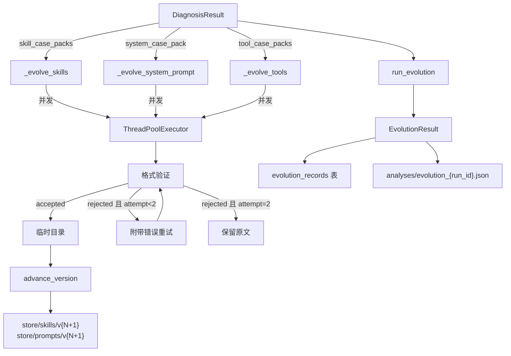

# 进化模块设计

> 对标 PyTorch 训练循环中的 `optimizer.step()`，读取诊断产出的案例包，调用 LLM 改写 Skill / System Prompt / Tool Prompt，格式验证后写入 Store 新版本。

## 1. 设计决策总览

| 决策项 | 选择 | 理由 |
|--------|------|------|
| 改写策略 | ProTeGi 式两步法 + 结构化约束 | 文献调研结论：显式梯度+定向编辑优于全量重写（REMO 证明纯 TextGrad 过拟合严重）和纯追加（AutoHint 2 轮后退化） |
| LLM 输出格式 | 单次调用，先建议列表后完整改写 | 建议列表是审计 trace，改写在同一 context 中完成，无需重传上下文 |
| 代码架构 | 三个独立进化函数 + 编排函数 | 三类目标特征差异大，独立函数职责清晰、可独立调试 |
| 进化模型 | DeepSeek V4 Pro，开启 thinking | 通过 `LLMClient.from_env("EVOLVE_LLM", thinking=True)` 接入 |
| 选择性进化 | 无失败案例的目标跳过 | 避免无改进信号时引入噪声改动 |
| 进化粒度控制 | `targets: set[str]` 参数 | 可选 `{"skills"}`, `{"system"}`, `{"tools"}` 的任意子集 |
| 验证策略 | 格式检查 + 冻结区校验，失败重试 1 次 | 性能验证由下一轮推理完成，进化步骤只管格式 |
| 持久化 | DB 存逐条元数据 + JSON 存完整内容快照 | 与推理/诊断模块规范一致 |

### 被否决的方案

| 方案 | 否决理由 |
|------|---------|
| OPRO 式全新生成 | 每步全量重写，不做编辑。我们的 prompt 是复杂多段结构，全量重写容易丢失已验证的有效模式 |
| AutoHint 式纯追加 | 不修改原文只追加 hint。2 轮后因 hint 堆叠导致信息冗余和矛盾 |
| EvoPrompt 式种群进化 | 维护种群开销大，我们每轮只需一个版本 |
| 策略模式 + 基类 | 对科研项目过度工程化，违反 YAGNI |
| 两次独立 LLM 调用 | 成本翻倍，第二次需重传完整上下文，收益仅为可在调用间人工审核 |

## 2. 数据流



## 3. 三类目标的可改写范围

### Skill 文件

| 区域 | 可改写 | 说明 |
|------|--------|------|
| frontmatter (`name`, `description`, `task_type`) | 冻结 | 元数据标识，改了破坏 Skill 发现机制 |
| 适用场景 | 可改写 | 可优化场景描述和示例 |
| 搜索步骤（Step 1/2/3） | **核心改写区** | 步骤数可增减，策略可重写，数据引用应更新 |
| 输出格式 | 部分可改 | JSON 基础结构（reflect/plan/action）不可变，reflect 内字段可调 |
| 自检信号 | 可改写 | 根据新案例更新 |
| 常见陷阱 | 可改写 | 根据新案例更新 |

### System Prompt (`system.md`)

| 区域 | 可改写 | 说明 |
|------|--------|------|
| 角色（前 2 段） | 可改写 | 可调整角色定位和行为倾向 |
| 能力边界 | 冻结 | 事实性描述 |
| 输出格式 | 冻结 | JSON schema 是系统契约 |
| 视频树结构 + 信任层级 | 冻结 | 数据结构事实描述 |
| 决策原则 | **核心改写区** | 搜索策略、预算分配 |
| 搜索工具使用 / 否定题原则 | 可改写 | 策略性建议 |
| 置信度语义 | 可改写 | 阈值和含义可微调 |

### Tool Prompt (`*_extract.md` / `*_verify.md`)

| 区域 | 可改写 | 说明 |
|------|--------|------|
| 角色定位（第 1 句） | 冻结 | 功能标识 |
| 输入说明 | 冻结 | 描述输入格式的事实 |
| 工作原则 | **核心改写区** | 提取/核实策略 |
| 输出格式 | 冻结 | 下游解析依赖固定格式 |

## 4. 进化 Prompt 模板设计

三类目标各有一个进化 prompt 模板，存放在 `prompts/` 目录下（与诊断 prompt 同级，不参与版本化）。

### 通用结构

```
角色设定 → 输入材料（当前内容 + 案例包） → 冻结区声明 → 输出要求
```

### 输入材料

| 目标类型 | 当前内容 | 案例包数据 |
|---------|---------|-----------|
| Skill | `store/skills/vN/{target_file}` | `SkillCasePack`: failure_cases + success_cases + stats (准确率, 错误归因, 搜索有效性, Skill 遵循率) |
| System | `store/prompts/vN/system.md` | `SystemCasePack`: failure_cases (过早提交/高置信答错/确认偏误) + success_cases + D5 统计 |
| Tool | `store/prompts/vN/{tool}_extract.md` + `{tool}_verify.md` | `ToolCasePack`: failure_spans + success_spans + 工具质量统计 |

### 统一输出格式

Skill 和 System:

```json
{
  "suggestions": [
    {
      "section": "搜索步骤 > Step 2",
      "problem": "当前策略建议顺序访问 L1，但失败案例显示...",
      "change": "改为优先 search_similar 定位",
      "related_cases": ["q_012", "q_045"]
    }
  ],
  "evolved_content": "---\nname: temporal-reasoning\n..."
}
```

Tool（一次改两个文件）:

```json
{
  "suggestions": [...],
  "evolved_extract": "你是一个视频节点内容分析器...",
  "evolved_verify": "你是一个视频节点摘要核实器..."
}
```

## 5. 格式验证

| 检查项 | Skill | System | Tool | 说明 |
|--------|-------|--------|------|------|
| JSON 可解析 | ✓ | ✓ | ✓ | LLM 输出必须是合法 JSON |
| `evolved_content` 非空 | ✓ | ✓ | ✓ | 防止空输出 |
| frontmatter 保留 | ✓ | — | — | 校验 name/description/task_type 与原文一致 |
| 冻结区未改动 | — | ✓ | ✓ | 子串匹配检查冻结 section 是否保留 |
| 长度合理 | ✓ | ✓ | ✓ | 不超过原文 2 倍，不低于 0.3 倍 |
| Markdown 合法 | ✓ | ✓ | — | 标题层级连续，代码块闭合 |

验证失败处理：附带验证错误信息重试 1 次（最多 2 次尝试），仍失败则标记 `rejected`，保留原文。每个目标独立重试。

## 6. 函数签名与编排

```python
def run_evolution(
    diagnosis: DiagnosisResult,
    workspace_dir: Path,
    store_dir: Path,
    skills_dir: Path,
    prompts_dir: Path,
    targets: set[str] = {"skills", "system", "tools"},
    concurrency: int = 4,
) -> EvolutionResult:
```

### 编排伪代码

```
1. client = LLMClient.from_env("EVOLVE_LLM", thinking=True)
2. 收集进化任务:
   skills: 遍历 skill_case_packs，跳过无 failure_cases 的
   system: 检查 system_case_pack 是否为 None
   tools:  遍历 tool_case_packs，跳过无 failure_spans 的
   按 targets 参数过滤
3. ThreadPoolExecutor 并发执行各任务
4. 收集 EvolutionRecord，统计 accepted/rejected/skipped
5. 版本写入:
   复制当前版本目录 → 临时目录
   用 accepted 的改写覆盖对应文件
   advance_version() 写入 Store（skills 和 prompts 独立版本化）
6. 写 DB（evolution_records 表）+ JSON（analyses/evolution_{run_id}.json）
7. 返回 EvolutionResult
```

## 7. 持久化

### 数据库表

```sql
CREATE TABLE IF NOT EXISTS evolution_records (
    id                INTEGER PRIMARY KEY,
    run_id            TEXT NOT NULL,
    target_file       TEXT NOT NULL,
    target_type       TEXT NOT NULL,
    status            TEXT NOT NULL,
    suggestions       JSON,
    validation_errors JSON,
    source_version    TEXT,
    result_version    TEXT,
    created_at        TEXT NOT NULL
);
```

### JSON 快照

`analyses/evolution_{run_id}.json` — EvolutionResult 全量序列化，含 `original_content` 和 `evolved_content` 用于人工 diff。

## 8. 版本写入流程

```
1. 创建临时目录 tempdir/skills/ 和 tempdir/prompts/
2. 从当前版本复制全部文件到 tempdir
3. 用 accepted 的改写覆盖对应文件
4. skills 有改动 → advance_version(store, "skills", tempdir/skills/, meta)
5. prompts 有改动 → advance_version(store, "prompts", tempdir/prompts/, meta)
6. meta: source="evolution", parent="vN", trigger_run=run_id
```

Skills 和 Prompts 独立版本化。

## 9. 数据类更新

现有 `evolve.py` 中的 `EvolutionRecord` 需补充字段以对齐 DB 表和审计需求：

```python
@dataclass
class EvolutionRecord:
    target_file: str          # 如 'temporal-reasoning.md'
    target_type: str          # 'skill' / 'system' / 'tool'（新增）
    original_content: str
    evolved_content: str
    reason: str
    status: str               # 'accepted' / 'rejected' / 'skipped'
    suggestions: list[dict[str, Any]]  # 改为 dict 列表（新增结构）
    attempts: list[dict[str, Any]]
    validation_errors: list[str]
    source_version: str       # 新增
    result_version: str | None  # 新增，rejected 时为 None
```

## 10. Runner 集成

`Runner` 新增 `evolve()` 方法，调用 `run_evolution()` 后更新 manifest 指向新版本。`main.py` 的 `train` 模式暂时实现为单次 `diagnose → evolve`，完整训练循环后续迭代。

## 11. 配置

### 新增环境变量

```
EVOLVE_LLM_MODEL=deepseek-v4-pro
EVOLVE_LLM_BASE_URL=https://api.deepseek.com/v1
EVOLVE_LLM_API_KEY=sk-xxx
```

### 文件清单

| 文件 | 操作 | 说明 |
|------|------|------|
| `core/harness/evolve.py` | 重写 | 从框架扩展为完整实现 |
| `prompts/evolve_skill.md` | 新增 | Skill 进化 prompt 模板 |
| `prompts/evolve_system.md` | 新增 | System Prompt 进化 prompt 模板 |
| `prompts/evolve_tool.md` | 新增 | Tool Prompt 进化 prompt 模板 |
| `core/harness/runner.py` | 修改 | 新增 `Runner.evolve()` |
| `core/harness/log.py` | 修改 | 新增 `evolution_records` 表 |
| `main.py` | 修改 | `train` 模式接入 evolve |
| `.env.example` | 修改 | 新增 EVOLVE_LLM_* |
| `config/default.yaml` | 修改 | 新增 evolution 默认配置 |

## 12. 文献支撑

本设计参考了以下论文（详见 `references/prompt-optimization/`）：

| 论文 | 核心借鉴 |
|------|---------|
| ProTeGi/APO (Pryzant et al., 2023) | 两步法：文本梯度 → 定向编辑。案例包即为我们的"文本梯度" |
| OPRO (Yang et al., 2023) | 优化轨迹意识：历史版本及其得分可作为上下文 |
| REMO (Wu & Qu, 2025) | epoch 级汇总反馈优于 sample 级，纯 TextGrad 过拟合严重 |
| AutoHint (Sun et al., 2023) | 追加式策略 2 轮后退化的教训：需要允许编辑而非只追加 |
| Self-Evolving Agents Survey (Fang et al., 2025) | 三定律约束：安全 > 性能保持 > 自主进化 |
| EvoPrompt (Guo et al., 2023) | 差分变异思想：只变异差异部分，保留共性 |
